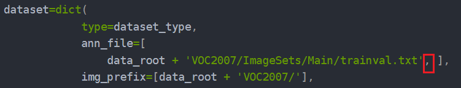

# YOLOv3+VOC2007

## 1.VOC2007数据集

**将数据集放到对应目录**，参照数据集——[目录结构概览](../shu-ju-ji/#1.-mu-lu-jie-gou-gai-lan)

## 2.mmdetection的YOLOv3使用


_<mark style="color:orange;">mmdetection默认为coco数据集，需要修改数据集配置信息</mark>_


### **1. 复制**

复制一份yolov3配置文件

_`cp ~/mmdetection/configs/yolo/yolov3_d53_mstrain-416_273e_coco.py ~/mmdetection/configs/yolo/yolov3_d53_mstrain-416_273e_coco_copy.py`_

### **2.修改**

打开\_**`yolov3_d53_mstrain-416_273e_coco_copy.py`**\_

* 修改\_**`model->bboxhead->num_classes = 20，`**\_因为VOC类别是20种
* 复制\_**`mmdetection/configs/base/datasets/voc0712.py`**_所有内容，替换_**`yolov3_d53_mstrain-416_273e_coco_copy.py中`**_整个_**`“# dataset setting”`**\_
* 将\_**`data->train->dataset->annfile/img_prefix`**_中，有2012的_**`data_root`**\_删掉。如果数据集中有VOC2012则不需要改动，注意多余的逗号要删掉

**完成以上三处修改，就可以训练了**

### **3.训练/测试细节**


训练的参数在[训练，测试章节](./)

参数修改说明放到了此处


#### 1. 使用标准数据集，如VOC2007，训练配置文件yolov3\_copy.py需要修改的参数可能有：

* _**`sample_per_gpu`**_
* _**`workers_per_gpu`**_
* _**`optimizer->lr`**_
* _**`runner->max_epochs`**_

\_**`sample_per_gpu/workers_per_gpu`**\_根据本地GPU、电脑内存，以及实际训练时每张图片训练需要的内存动态调整

_**`optimizer->lr，`**假设官方**`gpu`**个数**`*sample_per_gpu=64 lr`**设置为**`0.001，`**你的**`gpu_nums * sample_per_gpu==16`**_，学习率与这个值成正比，设置为 _<mark style="color:purple;">**`lr=0.001 * 16/64`**</mark>_

\_**`runner->max_epochs`**\_根据你自己需要的情况训练，官方log训练日志可作参考

#### 2. 训练及测试命令

```bash
(open-mmlab) xbsj@xbsj: 

python tools/train.py ${CONFIG_FILE} --work_dir ${YOUR_WORK_DIR}

# 单卡，指定模型输出目录
python tools/train.py \
    configs/yolo/yolov3_copy.py
    --work-dir ./work-dirs/my_yolov3

# 指定某个GPU，训练过程不评估
python tools/train.py \
    ./configs/faster_rcnn/faster_rcnn_r50_fpn_1x_coco.py \
    --gpus 1 --no-validate --work-dir my_faster

# 两个GPU训练,指定输出目录
./tools/dist_train.sh configs/yolov3_copy.py 2 --work-dir ./work-dirs/my_yolov3

# 两个GPU训练，指定输出目录，指定日志输出位置——便于查看错误
./tools/dist_train.sh configs/yolov3_copy.py 2 \
    --work-dir ./work-dirs/my_yolov3 \
    >> yolov3.log 2>&1

# 日志输出，训练命令后加上：
>> yolov3.log 2>&1

----------------------------------------------------------------
MMDet test (and eval) a model

positional arguments:
  config                test config file path
  checkpoint            checkpoint file

optional arguments:
  -h, --help            show this help message and exit
  --out OUT             output result file in pickle format
  --fuse-conv-bn        Whether to fuse conv and bn, this will slightly
                        increasethe inference speed
  --format-only         Format the output results without perform evaluation.
                        It isuseful when you want to format the result to a
                        specific format and submit it to the test server
  --eval EVAL [EVAL ...]
                        evaluation metrics, which depends on the dataset,
                        e.g., "bbox", "segm", "proposal" for COCO, and "mAP",
                        "recall" for PASCAL VOC
  --show                show results
  --show-dir SHOW_DIR   directory where painted images will be saved
  --show-score-thr SHOW_SCORE_THR
                        score threshold (default: 0.3)
  --gpu-collect         whether to use gpu to collect results.
  --tmpdir TMPDIR       tmp directory used for collecting results from
                        multiple workers, available when gpu-collect is not
                        specified
  --options OPTIONS [OPTIONS ...]
                        arguments in dict
  --launcher {none,pytorch,slurm,mpi}
                        job launcher
  --local_rank LOCAL_RANK

# --show-dir 把测试时检测图片保存到指定文件夹中（图片包含检测结果）

# 单GPU测试, 模型配置文件，checkpoints, 输出测试结果， 评估指标mAP，还有bbox等 --show
python tools/test.py \
    configs/yolo/yolov3_d53_mstrain-608_273e_coco_copy.py \
    checkpoints/latest.pth \
    --out results/test_yolov3.out.pkl \
    --eval mAP \
    --show

# 多GPU测试， ···， 2个GPU， ···， ···
./tools/dist_test.sh \
    configs/yolo/yolov3_d53_mstrain-608_273e_coco_copy.py \
    checkpoints/yolov3_d53_mstrain-608_273e_coco_20210518_115020-a2c3acb8.pth \
    2 \
    --out results/test_yolov3.out.pkl \
    --eval mAP \
    --show

# 鲁棒性测试 tools/analysis_tools/test_robustness.py
python tools/analysis_tools/test_robustness.py \
    configs/yolo/yolov3_copy.py \
    checkpoints/latest.pth \
    --out results/yolov3_test.out.pkl

# 训练时，骨干网络可能需要下载pretrained模型来预加载，如遇服务器网络不稳定情况，
# 可根据报错地址直接浏览器挂代理下载。
# 上传后在相应模型config文件中pretrained model的路径改为服务器本地路径即可。
model = dict(
    pretrained='open-mmlab://detectron2/resnet50_caffe' #这里改为本地路径
```


#### 3. 可能会出现的问题

```
# GPU内存溢出，修改，samples_per_gpu
RuntimeError: CUDA out of memory. Tried to allocate 40.00 MiB (GPU 0; 5.79 GiB total capacity; 4.47 GiB already allocated; 34.56 MiB free; 26.71 MiB cached)

# workers_per_gpu 影响加载速度，htop可看Memory使用情况，根据实际情况调整大小。
# 没有htop: sudo apt install htop

# PyTorch安装与CUDA版本(runtime 版本)不一致
RuntimeError:
    The detected CUDA version (9.1) mismatches the version that was used to compile
    PyTorch (11.3). Please make sure to use the same CUDA versions.

# 未安装或者安装后找不到，按照教程安装，可查看安装路径及python查找路径
# python -m site
File "tools/train.py", line 8, in <module>
    from mmdet import __version__
ModuleNotFoundError: No module named 'mmdet'

# 测试时，训练中保存下来的pth文件中没有CLASSES信息，
”warnings.warn('Class names are not saved in the checkpoint’s ’ "
```


***

**4. 训练日志可视化**


**如果是断点训练，使用某一epoch或者latest.pth**

**默认输出的log.json，无法直接使用，需要自行与之前的日志进行拼接。**

**假设有1.log.json和2.log.json**

* 删除1.log.json多余半个epoch的输出，与2.log.json头部多余输出。
* 将2.log.json追加到1.log.json，使用1.log.json文件进行loss可视化


```bash
(open-mmlab) xbsj@xbsj: 

python tools/my_voc_eval.py ${RESULT_FILE} ${CONFIG_FILE}


python ~/mmdetection/tools/analysis_tools/analyze_log.py \
    plot_curv work_dirs/yolov3/test.log.json \
    --keys loss loss_cls loss_conf \
    --out ~/mmdetction/work_dirs/yolov3/yolo_loss.png

# plot_curv 指定json格式日志文件
# --keys 指定loss，可以有多个，具体的可以去log里看
# --out  指定输出的可视化图片的位置

# 计算训练时间
python tools/analyze_logs.py cal_train_time \
    ./1_work_dir_gfl_hat_hair_beard/20200805_154359.log.json
```

**voc格式的数据集在测试后并不会直接输出mAP，** 需要保存测试结果另外计算mAP

## 3.补充

### 配置

* \_`../base/models/faster_rcnn_r50_fpn.py`\_模型文件
* `../base/datasets/coco_detection.py`训练数据配置
* \_`../base/schedules/schedule_1x.py`\_训练策略，例如学习率，最大epoch
* \_`../base/default_runtime.py`\_日志等信息

### 日志

* `date_time.log` 训练输出的日志信息
* `date_time.log.json` 训练过程中的损失、学习率、精度等信息，主要是为了数据可视化展示，方便调试
* 有博客说训练损失为0，需要加逗号，目前训练过程没有遇到。


